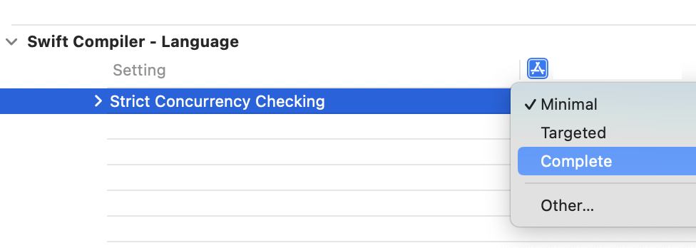

# How-to

Some features are available directly as Xcode Build Settings while others can be passed as build command line arguments or settings in a Swift Package Manager `Package.swift` file.



Programatically, it's possible to determine if a feature is available using the `#if` directive:

```swift
#if hasFeature(StrictConcurrency)
#endif
```

See [Proposa SE-0362](https://github.com/apple/swift-evolution/blob/main/proposals/0362-piecemeal-future-features.md) for more details.

## Upcoming

A compiler flag is available to enable specific features `-enable-upcoming-feature FeatureName`. In SPM, features can be enabled in `Package.swift` using the `enableUpcomingFeature` setting:

```swift
.target(
    name: "TargetName",
    swiftSettings: [
        .enableUpcomingFeature("FeatureName")
        ])
```

## Experimental

A compiler flag is available to enable specific features `-enable-experimental-feature FeatureName`. In SPM, features can be enabled in `Package.swift` using the `enableExperimentalFeature` setting:

```swift
.target(
    name: "TargetName",
    swiftSettings: [
        .enableExperimentalFeature("FeatureName")
        ])
```
